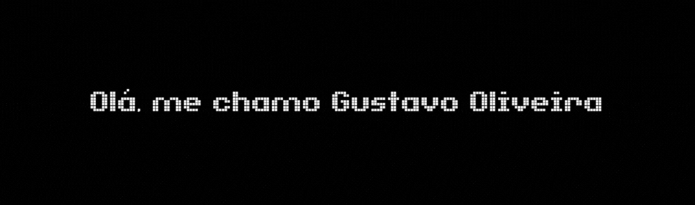

---

---

  

   𝙳𝚎𝚜𝚎𝚗𝚟𝚘𝚕𝚟𝚎𝚍𝚘𝚛 𝚏𝚛𝚘𝚗𝚝-𝚎𝚗𝚍 𝚌𝚘𝚖 𝚎𝚡𝚙𝚎𝚛𝚒𝚎𝚗𝚌𝚒𝚊 𝚎𝚖 𝚄𝙸/𝚄𝚇, 𝙹𝚊𝚟𝚊𝚂𝚌𝚛𝚒𝚙𝚝 𝚎 𝚍𝚎𝚜𝚎𝚗𝚟𝚘𝚕𝚟𝚒𝚖𝚎𝚗𝚝𝚘 𝚠𝚎𝚋. 𝙵𝚘𝚌𝚊𝚍𝚘 𝚎𝚖 𝚌𝚛𝚒𝚊𝚛 𝚜𝚘𝚕𝚞ç𝚘𝚎𝚜 𝚎𝚏𝚒𝚌𝚒𝚎𝚗𝚝𝚎𝚜 𝚎 𝚊𝚕𝚒𝚗𝚑𝚊𝚍𝚊𝚜 𝚊 𝚛𝚎𝚚𝚞𝚒𝚜𝚒𝚝𝚘𝚜 𝚝𝚎𝚌𝚗𝚒𝚌𝚘𝚜 𝚎 𝚏𝚞𝚗𝚌𝚒𝚘𝚗𝚊𝚒𝚜. 𝚃𝚊𝚖𝚋𝚎𝚖 𝚊𝚝𝚞𝚘 𝚌𝚘𝚖 𝚒𝚕𝚞𝚜𝚝𝚛𝚊ç𝚊𝚘 𝚍𝚒𝚐𝚒𝚝𝚊𝚕, 𝙲𝚘𝚗𝚌𝚎𝚙𝚝 𝙰𝚛𝚝 𝚎 𝙿𝚒𝚡𝚎𝚕 𝙰𝚛𝚝 - 𝙲𝚛𝚒𝚊ç𝚊𝚘 𝚎 𝙰𝚗𝚒𝚖𝚊ç𝚊𝚘 — (𝙿𝚊𝚛𝚊 𝙹𝚘𝚐𝚘𝚜 𝚘𝚞 𝙸𝚗𝚝𝚎𝚛𝚏𝚊𝚌𝚎𝚜).
  

  

"A verdadeira sabedoria está em reconhecer a própria ignorância." — Sócrates
     &emsp;   &emsp;   &emsp; &emsp;
  

  
---
<h5 align="center">- 𝐓𝐄𝐂𝐍𝐎𝐋𝐎𝐆𝐈𝐀𝐒, 𝐅𝐄𝐑𝐑𝐀𝐌𝐄𝐍𝐓𝐀𝐒 𝐄𝐒𝐓𝐀𝐓𝐈𝐒𝐓𝐈𝐂𝐀𝐒 -</h5>

 

  

   &nbsp;&nbsp;&nbsp;
   &nbsp;&nbsp;&nbsp;
   &nbsp;&nbsp;&nbsp;
   &nbsp;&nbsp;&nbsp;
   &nbsp;&nbsp;&nbsp;
   &nbsp;&nbsp;&nbsp;
   

  

  
  

---

<h5></h5>
 

| GitHub | LinkedIn | Portfólio |
|--------|----------|-----------|
|  |  |  |

 
  

